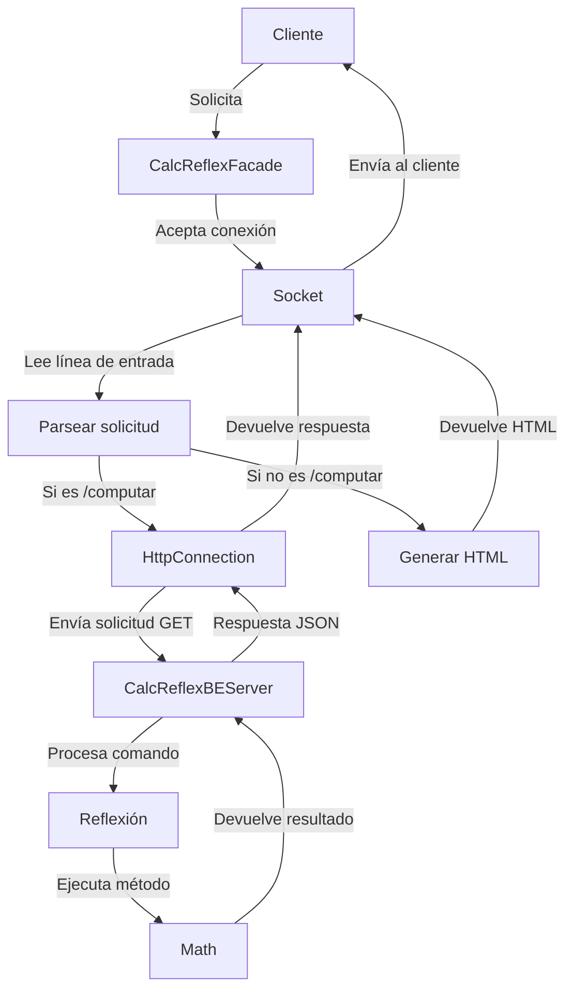
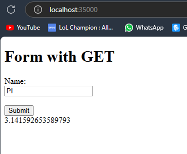
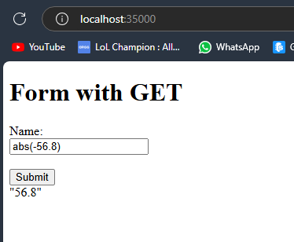
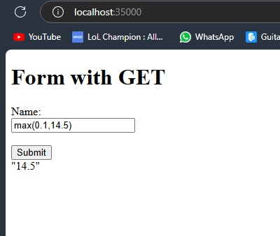

# AREP-BONO01
## Autor: David Leonardo Piñeros Cortes

## Arquitectura

### CalcReflexFacade
Actúa como el servidor principal que escucha en el puerto 35000.
Acepta conexiones de clientes y maneja solicitudes de computación y de página HTML.
Tiene métodos para generar respuestas HTML y manejar las solicitudes recibidas.

### HttpConnection:
Es la encargada de conectar la fachada con el backend de la calculadora mediante solicitud HTTP GET al servicio en el puerto 36000.
Establece la conexión, envía la solicitud y recibe la respuesta del servidor.

### CalcReflexBEServer:
Es otro servidor que escucha en el puerto 36000 y maneja las solicitudes de computación.
Utiliza la reflexión para invocar métodos de la clase Math y ejecutar operaciones matemáticas basadas en las solicitudes.
Responde a las solicitudes con resultados en formato JSON.



### Compilacion y Ejecucion
El primer paso es clonar el repositorio
```
git clone https://github.com/leoncico/AREP-BONO01.git
```

Luego entrar al directorio resultante y ejecutar el comando de maven para compilar
```
mvn clean install
```

Luego se ejecutan los siguientes comando para ejecutar el programa con java. De ser necesario abrir dos
terminales

```
mvn exec:java -Dexec.mainClass="escuelaing.edu.co.calcreflex.CalcReflexFacade"
```
mvn exec:java -Dexec.mainClass="escuelaing.edu.co.calcreflex.CalcReflexBEServer"
```
java -cp target/classes escuelaing.edu.co.calcreflex.CalcReflexFacade
```

Finalmente ingresa a localhost:35000 y digita operaciones matematicas de la libreria Math

* Para 0 parametros


* Para 1 parametro


* Para 2 parametros
